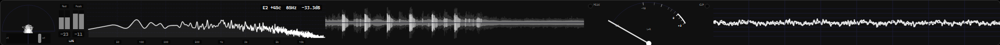
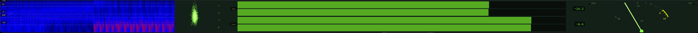
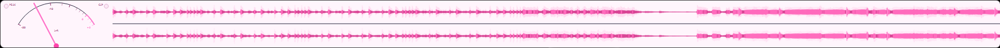
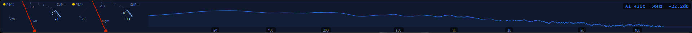
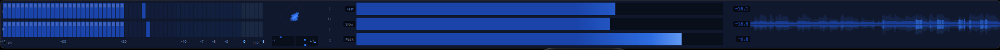
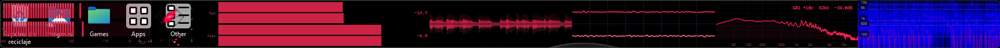
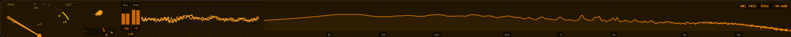
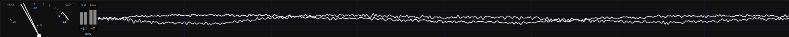
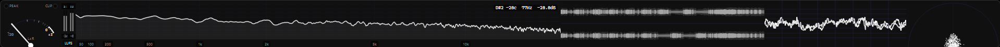

# PyDSPMeters 🎛️
> **Professional-grade, high-performance audio visualization suite built for modern workflows.**

[](LICENSE)
[](https://python.org)
[](https://pyside.org)
[](https://numpy.org)

PyDSPMeters is a modular, ultra-responsive audio monitoring suite designed to rival professional desktop solutions. It provides a flexible, always-on-top interface for engineers, producers, and audiophiles who need critical signal feedback without sacrificing screen real estate.

## ♾️ Infinite Modularity











---

## ⚡ Engineered for Performance

Built from the ground up to handle high-resolution displays and high-density audio streams, PyDSPMeters utilizes a optimized processing pipeline:

*   **Zero-Copy DSP**: Leveraging NumPy's vectorized operations for lightning-fast FFT calculations and signal analysis.
*   **Rust PyO3 Native Acceleration**: Performance critical hot-paths (bulk array modifications, circular buffers, column interpolations) are processed via a zero-copy compiled Rust module (`dsp_accel`), allowing the app to hit locked 60 FPS while keeping CPU usage low.
*   **Circular Buffer Rendering**: Advanced `QImage` caching for modules like the Spectrogram ensures smooth scrolling even at 4K/8K resolutions.
*   **Low-Latency Hooking**: Direct interface with system audio drivers via PyAudio with minimal buffer overhead.
*   **Adaptive UI**: Dynamic text scaling and intelligent layout distribution that keeps meters readable from 60px to full-screen.

---

## 🏗️ Infinite Modularity

PyDSPMeters adapts to *your* workflow, not the other way around.

*   **Stackable Architecture**: Add, remove, and reorder modules on the fly. Build exactly the monitoring rig you need.
*   **Omni-Layout**: Seamlessly toggle between **Vertical** and **Horizontal** modes. Fit the meters into a side-bar, a bottom-strip, or a dedicated second monitor.
*   **Ghost Mode**: Transparent and Glass presets combined with an auto-hiding title bar allow the meters to "float" over your DAW or editor.
*   **Edge Snapping**: Intelligent window management that locks to screen edges for a pixel-perfect setup.

---

## 🎚️ The Visualization Suite

| Module | Description | Key Features |
| :--- | :--- | :--- |
| **Loudness** | EBU R128 Compliant | Integrated LUFS, RMS, and Peak monitoring. |
| **Spectrum** | High-Res FFT | Mel/Log scales, spatial smoothing, and peak tracking. |
| **Stereo** | Phase Analysis | Lissajous rendering and multi-band correlation. |
| **Spectrogram** | Frequency History | Optimized circular heatmap with customizable palettes. |
| **Waveform** | Amplitude History | Mirrored intensity-based waveform with real-time scaling. |
| **VU Meter** | Analog Classic | Precision ballistics with themed LED status indicators. |
| **Oscilloscope** | Signal Detail | Ultra-responsive waveform plotting at high zoom levels. |

---

## 🎨 Theme Engine

Express your aesthetic with a wide range of built-in presets:

*   **Midnight**: Deep studio dark with vibrant cyan accents.
*   **Modern Light**: Clean, professional light theme with indigo/blue meters.
*   **Abyss**: Pure black OLED-ready interface.
*   **Transparent Ghost**: Borderless, floating UI for minimal distraction.
*   **Aurora, Crimson, Solar**: High-contrast, color-focused palettes for visibility.

---

## 📦 Getting Started

### Prerequisites
*   Python 3.9+
*   Audio Input Device (Microphone, Stereo Mix, or Virtual Cable)

### Installation
```bash
# Clone the repository
git clone https://github.com/ThatOneFBIAgent/PyDSPMeters.git
cd PyDSPMeters

# Install dependencies
pip install -r requirements.txt

# Launch
python main.py
```

Additionally you can run `python build_dist.py` to compile a standalone executable, if you have nuitka and a C++ compiler installed. Or just create a shortcut (or run via terminal) using **pythonw** to hide the console:

```bash
pythonw "path/to/main.pyw"
```

---

## 🏎️ Rust Native Acceleration (dsp_accel)

PyDSPMeters includes a custom-built Rust crate (`dsp_accel`) using `PyO3` and `maturin` that drastically accelerates DSP processing and display buffering. 
The application includes a graceful fallback system—if the Rust module is not compiled or fails to load, it will seamlessly fall back to pure Python/NumPy logic (meaning the app will always run, just slightly slower).

### Building the Native Module
If you are developing or running from source and want maximum performance, you must compile the Rust crate. You will need:
1. [Rust Toolchain](https://rustup.rs/) (cargo/rustc)
2. Python development headers
3. `maturin` installed (`pip install maturin`)

**Build Command:**
```bash
cd native
maturin build --release
pip install target/wheels/dsp_accel-*.whl --force-reinstall
```

### Common Troubleshooting
*   **Missing Visual C++ Build Tools (Windows)**: If `maturin` fails on Windows, ensure you have the "Desktop development with C++" workload installed via Visual Studio Installer.
*   **Environment Not Found**: If `maturin` complains about missing `VIRTUAL_ENV`, it means you aren't running inside an active Python virtual environment. You can either activate your venv or build the wheel with `maturin build --release` and install it manually via pip as shown above.
*   **Verifying it works**: The app will automatically route processing through Rust if the module is installed. You can verify it's working if CPU usage drops significantly and visual stutters in the Spectrogram and Waveform modules disappear.

---

## ⌨️ Shortcuts & Workflow

*   **Right-Click**: Access deep settings for any specific module (Scale, Speed, Channels).
*   **⚙ Gear Icon**: Global configuration (Device selection, Themes, Input Gain, Label Scaling).
*   **+ Plus Icon**: Instantly append new modules to the current layout.
*   **▥/▤ Layout Icon**: Switch between vertical stacking and horizontal strips.
*   **Portability**: PyDSPMeters is fully portable; all configurations are stored in `settings.json` within the root directory.

---

## 🛠️ Development & Testing

We utilize `pytest` for ensuring DSP accuracy and stability:
```bash
python -m pytest
```

## 📜 License
Licensed under the [MIT License](LICENSE). Build, modify, and share.
